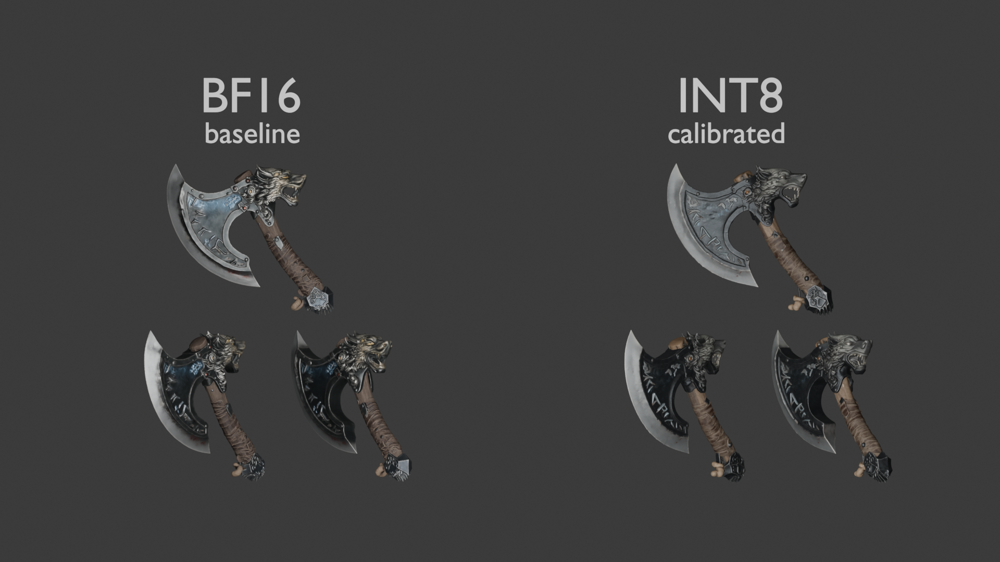

# TRELLIS.2 quantization study (bf16 vs int8 vs naive fp8)

Preliminary, non-benchmark study of ComfyUI TRELLIS.2 DiT weight dtypes:
bf16 baseline, a calibrated int8 checkpoint (third-party), and a naive fp8 cast
produced in this repo.

- **This is not a quality leaderboard.** Numbers are from one machine, one
  workflow, seeds 56 / 42 / 43. Treat them as a diagnostic record, not a claim
  that one dtype is "best".
- Model weights are **not** stored in this repository.

## Task

Image → 3D mesh with ComfyUI TRELLIS.2 / Pixal3D workflow. Compare:

| Variant | Origin | Weights |
|---------|--------|---------|
| bf16 baseline | Comfy-Org TRELLIS.2 | `trellis_2_bf16` (reference) |
| int8 (calibrated) | Comfy-Org, third-party quant | `trellis_2_int8_convrot` |
| fp8 (naive) | **This repo** (`scripts/quant_bf16_to_fp8.py`) | cast 2D `*.weight` → `float8_e4m3fn`, no scale |

Naive fp8 is a diagnostic cast, not a production quantization method.

## Environment

| Item | Value |
|------|--------|
| ComfyUI | `3dd559d81f745747cab884a3b9f5fd8867d79efe` (2026-09-20) |
| Python | 3.12.10 |
| PyTorch | 2.12.1+cu130 |
| CUDA | 13.0 |
| GPU | NVIDIA GeForce RTX 5060 Ti, 16 GB |
| Driver | 616.92 |
| OS | Windows |

## Input image

Workflow node `LoadImage` (node id **122**) expects `viking_wolf_rune_axe.png`
in ComfyUI's `input/` folder.

- Local input image used for the runs: `input/viking_wolf_rune_axe.png`
  (true PNG, converted from a local JPEG copy `input/viking_wolf_rune_axe.jpg`).
- Official template image is linked separately:
  https://raw.githubusercontent.com/Comfy-Org/workflow_templates/refs/heads/main/input/viking_wolf_rune_axe.png
- Any clean product-style object image works; this axe was used for the runs
  below. Local and official files are **not** asserted to be byte-identical.

## Models required by the workflow

Place files under `ComfyUI/models/` (see workflow metadata for HF URLs):

| Folder | File (example) |
|--------|----------------|
| `diffusion_models/` | `trellis_2_bf16.safetensors` or `trellis_2_int8_convrot.safetensors` |
| `vae/` | `trellis_2_shape_vae_bf16.safetensors`, `trellis_2_texture_vae_bf16.safetensors` |
| `clip_vision/` | `dino_v3_L_naf_fp32.safetensors` |
| `geometry_estimation/` | `moge_2_vitl_normal_fp16.safetensors` |
| `background_removal/` | `birefnet.safetensors` |

**bf16 vs int8 switch** (saved graph node ids):

| Node id | Type | Saved value | Role |
|---------|------|-------------|------|
| **40** | `UNETLoader` | `trellis_2_int8_convrot.safetensors`, `weight_dtype=default` | shape / structure DiT — swap to `trellis_2_bf16.safetensors` for baseline |
| **319** | `UNETLoader` | `pixal3d_int8_convrot.safetensors`, `weight_dtype=default` | texture / related DiT (int8 in the saved graph) |
| **122** | `LoadImage` | `viking_wolf_rune_axe.png` | input image |
| **316** | `PrimitiveBoolean` | “Switch to Trellis2” | graph switch (title in UI) |

The saved workflow ships with **int8** unet names selected. For the bf16 baseline
run, set node **40** `unet_name` to `trellis_2_bf16.safetensors` (and texture unet
if you also compare that stage). `weight_dtype` was left as `default` in both runs.

### Sampler settings (from the saved workflow)

| Stage (approx.) | steps | cfg | sampler | scheduler |
|-----------------|-------|-----|---------|-----------|
| structure | 12 | 1.0 | euler | normal |
| img2shape | 12 | 7.5 | euler | normal |
| shape refine / other | 20 | 7.5 | euler | normal |
| texture / other | 12 | 7.5 | euler | simple |

Resolution 1024×1024. Per-seed logs were not retained; the table below is the
aggregate record from the study runs.

## Results (seeds 56 / 42 / 43, one workflow)

| Metric | bf16 baseline | int8 calibrated |
|--------|---------------|-----------------|
| KSampler time (shape) | ~91 s | ~66 s |
| Full prompt time | 292.31 s | 277.77 s |
| Staged VRAM (approx., from run logs) | 9854 MB | 5004 MB |
| Mesh vertices | 6.49 M | 7.66 M |
| Load / crash | OK | OK |
| Visual result | reference | **visually comparable** on these seeds |

VRAM numbers are approximate values recorded during the runs; we did not
re-measure with an external profiler for this repo.



*Left: bf16 baseline. Right: calibrated int8. Three seeds / views per side.*

Visual comparison: on these three seeds the meshes are **visually comparable**
(same object, same overall quality; minor surface/rune differences). This is
**not** a claim that int8 ≡ bf16 in general — only what we observed here.

Post-processing time (~210 s) is excluded from the KSampler numbers above.

### fp8 (naive) — not measured as a full run

| Metric | fp8 naive |
|--------|-----------|
| Load in ComfyUI | **Crashes** at model init (see below) |
| KSampler / VRAM / mesh | **Not obtained** |

fp8 was not included as a third row in the mesh comparison because no valid mesh
was produced. See [docs/upstream-issue.md](docs/upstream-issue.md).

## Reproduction

### 1. Standalone scripts (no ComfyUI)

```bash
pip install -r requirements.txt

# Naive fp8 cast (needs ~20+ GB free RAM and disk for input+output)
python scripts/quant_bf16_to_fp8.py path/to/trellis_2_bf16.safetensors path/to/trellis_2_fp8_naive.safetensors

# Compare two checkpoints (prints metrics; optional CSV)
python scripts/compare_weights.py path/to/trellis_2_bf16.safetensors path/to/trellis_2_fp8_naive.safetensors --csv results/weight_damage.csv
```

### 2. ComfyUI workflow (meshes)

1. Install ComfyUI (study used commit `3dd559d8`).
2. Download models listed above into `ComfyUI/models/...`.
3. Put the input image into `ComfyUI/input/viking_wolf_rune_axe.png`.
4. Open `workflows/trellis2_image_to_model.json`.
5. Select bf16 or int8 diffusion model; queue; compare meshes.

## FP8 failure analysis

### What we did

1. Cast bf16 2D `*.weight` tensors → `float8_e4m3fn` with no scale factors
   (`scripts/quant_bf16_to_fp8.py`). File ~5.2 GB vs ~10.3 GB bf16.
2. Load through normal ComfyUI diffusion-model path.

### Crash

ComfyUI returns fp8 as the unet dtype when the checkpoint is fp8 and the GPU
supports fp8 compute, even though `Trellis2.supported_inference_dtypes` is
`[bfloat16, float32]`. `SparseStructureFlowModel.__init__` then calls
`torch.arange(..., dtype=fp8)`, which PyTorch does not implement.

Full traceback, environment, and suggested fixes:
[docs/upstream-issue.md](docs/upstream-issue.md).

### Weight damage (naive cast vs bf16)

Metrics from `scripts/compare_weights.py` on the actual study checkpoints
(`results/weight_damage.csv`). **Layer names below are the exact state-dict
keys** used in the CSV and in `compare_weights.py` `LAYERS` (ComfyUI prefix
`model.` included):

| Layer (state-dict key) | mae / mean\|ref\| | zero bf16 | zero fp8 | new zero (fp8 only) |
|------------------------|-------------------|-----------|----------|---------------------|
| `model.structure_model.t_embedder.mlp.0.weight` | 0.064 | 0.000 | 0.152 | **0.152** |
| `model.structure_model.blocks.0.self_attn.to_qkv.weight` | 0.037 | 0.000 | 0.067 | **0.067** |
| `model.structure_model.blocks.0.self_attn.to_out.weight` | 0.042 | 0.000 | 0.062 | **0.062** |
| `model.structure_model.adaLN_modulation.1.weight` | 0.029 | 0.000 | 0.034 | **0.034** |
| `model.structure_model.input_layer.weight` | 0.023 | 0.000 | 0.003 | **0.003** |
| `model.structure_model.out_layer.weight` | 0.032 | 0.000 | 0.034 | **0.034** |
| `model.img2shape.input_layer.weight` | 0.022 | 0.000 | 0.006 | **0.006** |
| `model.img2shape.out_layer.weight` | 0.026 | 0.000 | 0.021 | **0.021** |

**Metric definition:** `mae / mean|ref| = mean(|x − ref|) / mean(|ref|)`.
This is **not** an L2 relative error. `new_zero_frac` = fraction of elements
that are exactly zero in fp8 but not zero in bf16.

**Finding:** in these layers the bf16 tensors have essentially **no exact
zeros**; the naive fp8 cast **introduces** zeros (up to ~15% in
`model.structure_model.t_embedder.mlp.0.weight`). That is consistent with
small-magnitude weights underflowing e4m3 without scale factors. The load
crash itself is dtype plumbing and does **not** depend on weight values.

### Local experiment (not a fix)

With a local one-liner forcing RoPE coordinate dtype to a supported type, the
model constructed and sampling started. The structure stage then produced an
empty coordinate layout (`Trellis2 coords can't be empty`). Cause **not**
asserted; may or may not relate to naive fp8 weights. The patch was **reverted**
and is not shipped as a fix.

## What is mine vs third-party

| Artifact | Origin |
|----------|--------|
| Naive fp8 script + weight-damage analysis | This study |
| bf16 / int8 meshes, timings, VRAM | Local runs of this study |
| ComfyUI TRELLIS.2 runtime + workflow graph | Comfy-Org / community |
| Calibrated int8 checkpoint | Comfy-Org (`trellis_2_int8_convrot`) |
| Input test image | Local asset used with Comfy-Org workflow template |
| Bug report draft | This study → [ComfyUI issues](https://github.com/comfyanonymous/ComfyUI/issues) |

## Repository layout

```
input/
  viking_wolf_rune_axe.jpg|.png   # test input (PNG is a converted copy of the local JPEG)
scripts/
  quant_bf16_to_fp8.py            # research-only: 2D *.weight -> fp8_e4m3fn (CLI, no scale)
  compare_weights.py              # mae/mean|ref| + zero fractions between checkpoints
workflows/
  trellis2_image_to_model.json
results/
  weight_damage.csv
  mesh_bf16_vs_int8.png
docs/
  upstream-issue.md               # draft issue for Comfy-Org/ComfyUI
requirements.txt
LICENSE
.gitignore
```

## Licenses / terms

- Study scripts and docs: MIT (see `LICENSE`).
- TRELLIS.2, Pixal3D, ComfyUI, and model weights remain under their upstream
  licenses. This repo does **not** relicense them and does **not** redistribute
  weights.
- Workflow graph based on Comfy-Org templates — see those repositories for
  their terms.
- Input image: local test asset used for the runs; official template input is
  linked separately and is not asserted to be byte-identical. If you
  redistribute it, confirm you have the rights.

## Disclosure

This repository was prepared with AI-assisted tooling (OpenCode). All numbers
and claims above were checked against local runs; no results are invented.
If something looks off, open an issue or PR.

## Next steps

- After local review: publish this repository, fill the repository URL in
  `docs/upstream-issue.md`, then submit the bug report to Comfy-Org/ComfyUI.
- Optional later: calibrated fp8 (scale factors) would be a separate experiment —
  not claimed here.
